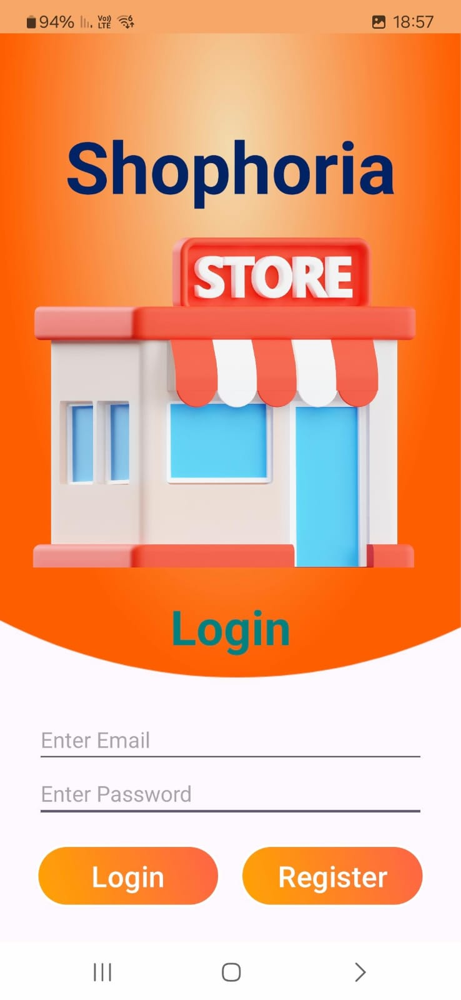
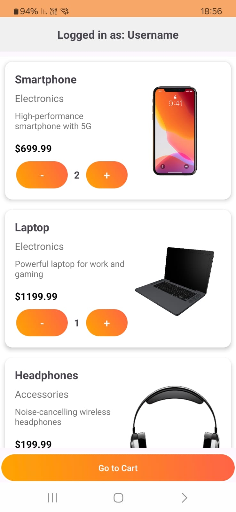

# Shopping App

A simple shopping application that allows users to browse products, add them to their cart, and view the cart. Users can log in with their email, and their cart and purchase history are stored and retrieved from Firebase.

## Features

- User authentication via email
- Product browsing with details (name, category, description, price, etc.)
- Add products to the cart
- View and manage the cart
- Purchase items and update purchase history
- Data is stored and synchronized with Firebase

## Technologies Used

- **Android** (Java)
- **Firebase** (Database, Authentication)
- **RecyclerView** for displaying product list
- **Navigation Component** for navigating between fragments
- **Toast** for displaying success and error messages
- **Shared Preferences** (Optional for storing user sessions)

|  |  |
|------------------------------|------------------------------|
| Login / Register Fragment - through Firebase DB | Main app add / remove items |
